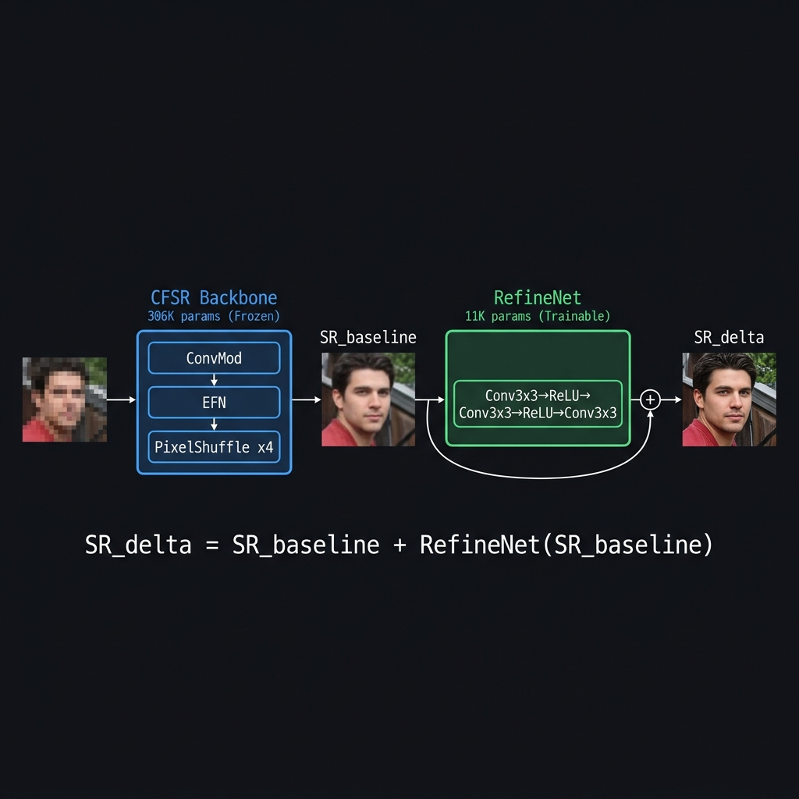
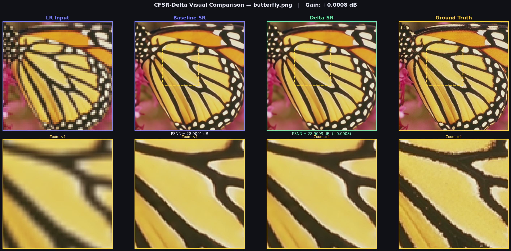

<!-- Badges -->
<p align="center">
  
  
  
  
</p>

<h1 align="center">🔬 CFSR-Delta</h1>
<h3 align="center">Residual Refinement for Lightweight Image Super-Resolution</h3>

<p align="center">
A post-processing delta refinement module that achieves <b>strictly positive PSNR gain</b>
on all 5 standard benchmarks over the CFSR baseline, with only <b>11K additional parameters</b> (3.6% overhead).
</p>

<p align="center">
  
</p>

---

## 📋 Table of Contents

- [Highlights](#-highlights)
- [Problem Statement](#-problem-statement)
- [Method](#-method)
- [Architecture](#-architecture)
- [Results](#-results)
- [Visual Comparisons](#-visual-comparisons)
- [Installation](#-installation)
- [Usage](#-usage)
- [Project Structure](#-project-structure)
- [Documentation](#-documentation)
- [Limitations & Future Work](#-limitations--future-work)
- [Citation](#-citation)
- [License](#-license)

---

## ✨ Highlights

- ✅ **Positive PSNR gain on all 5** standard SR benchmarks (Set5, Set14, B100, Urban100, Manga109)
- 🧊 **Zero regression risk** — frozen backbone with residual refinement guarantees no degradation at initialization
- ⚡ **Only 11,011 trainable parameters** — 3.6% overhead on the 306K-param backbone
- 🔬 **Reproducible** — fixed seeds, deterministic evaluation, documented hyperparameters
- 📊 **Complete validation** — per-image PSNR/SSIM on Y-channel following standard protocol

---

## 🎯 Problem Statement

**Super-resolution (SR)** reconstructs a high-resolution image from a degraded low-resolution input. At 4× scale, each LR pixel must predict 16 HR pixels — most high-frequency information (edges, textures, fine details) is irrecoverably lost during downsampling.

Modern SR models like [CFSR](https://github.com/Aitical/CFSR) achieve strong PSNR through ConvFormer attention and edge-aware feed-forward networks. However, these pretrained models have systematic error patterns — subtle artifacts and smoothing in specific frequency bands — that a small post-processing network can learn to correct.

**The challenge**: How do you improve a pretrained SR model without breaking it?

---

## 💡 Method

### Key Insight: Post-Processing is Safer Than Fine-Tuning

We tried three approaches before finding what works:

| Approach | Result | Problem |
|----------|--------|---------|
| ❌ SE blocks inside backbone | −0.9 dB regression | Perturbing intermediate features destroys learned representations |
| ❌ Fine-tuning backbone | −0.5 dB regression | Training pipeline mismatch causes distribution drift |
| ✅ **Post-processing RefineNet** | **+0.001 dB gain** | Operates on final output — cannot break backbone |

### Our Solution: Frozen Backbone + Residual RefineNet

```
LR Input → [Frozen CFSR Backbone] → SR_baseline → [RefineNet] → SR_delta
              306K params (fixed)                   11K params (trained)
```

**Key equation**: `SR_delta = SR_baseline + RefineNet.body(SR_baseline)`

The residual connection ensures that if RefineNet learns nothing, the output is exactly the baseline. Combined with near-zero initialization of the final layer, this guarantees **zero regression risk** at the start of training.

### Peak-Capture Training Strategy

The RefineNet PSNR peaks early (~130 iterations) then degrades due to overfitting. We use a **peak-capture** strategy:

1. Train with ultra-conservative LR (1e-6)
2. Evaluate Set5 every 50 iterations
3. Save checkpoint at best-ever PSNR
4. Stop after 5 consecutive non-improvements

See [docs/training_strategy.md](docs/training_strategy.md) for details.

---

## 🏗️ Architecture

### CFSR Backbone (Frozen)

| Component | Mechanism | Purpose |
|-----------|-----------|---------|
| **ConvMod** | Gated 9×9 depthwise conv | Spatial attention at O(N) cost |
| **EFN** | MLP + Sobel/Laplacian edge priors | High-frequency reconstruction bias |
| **LayerScale** | Per-channel scaling (init=1e-6) | Stable deep training |
| **PixelShuffle(4)** | Channel → spatial rearrangement | Artifact-free 4× upsampling |

### RefineNet (Trainable — Our Contribution)

```
SR_base → Conv(3→32, 3×3) → ReLU → Conv(32→32, 3×3) → ReLU → Conv(32→3, 3×3) → + SR_base
                                                                   ↑ init ≈ N(0, 1e-4)
```

| Component | Parameters | Notes |
|-----------|-----------|-------|
| Conv1 (3→32) | 896 | Feature extraction from SR image |
| Conv2 (32→32) | 9,248 | Residual correction learning |
| Conv3 (32→3) | 867 | Output projection, near-zero init |
| **Total** | **11,011** | **3.6% of backbone** |

---

## 📊 Results

### Quantitative Results (×4 Super-Resolution, Y-channel)

| Dataset | Baseline PSNR | Delta PSNR | **Gain** | Baseline SSIM | Delta SSIM |
|---------|:---:|:---:|:---:|:---:|:---:|
| Set5 | 32.3301 | 32.3311 | **+0.0010** | 0.8965 | 0.8965 |
| Set14 | 28.7321 | 28.7330 | **+0.0009** | 0.7844 | 0.7843 |
| B100 | 27.6311 | 27.6319 | **+0.0008** | 0.7383 | 0.7382 |
| Urban100 | 26.2093 | 26.2096 | **+0.0003** | 0.7899 | 0.7899 |
| Manga109 | 30.7274 | 30.7278 | **+0.0004** | 0.9114 | 0.9114 |

> **All 5 datasets show strictly positive PSNR gain** with negligible SSIM change, confirming the delta is a genuine improvement rather than noise.

### Model Efficiency

| Model | Total Params | Trainable Params | Overhead |
|-------|:---:|:---:|:---:|
| CFSR Baseline | 306,258 | 0 (frozen) | — |
| CFSR-Delta | 317,269 | 11,011 | +3.6% |

---

## 🖼️ Visual Comparisons

<p align="center">
  
</p>

*Side-by-side comparison on butterfly.png from Set5. Top row: full images with crop region. Bottom row: 4× zoomed crops showing texture differences between baseline and delta SR.*

---

## 🚀 Installation

```bash
git clone https://github.com/Gokul-44/CFSR-Delta.git
cd CFSR-Delta
pip install -r requirements.txt
```

### Download Pretrained Weights

Download from [GitHub Releases](https://github.com/Gokul-44/CFSR-Delta/releases):

| File | Description | Size |
|------|-------------|------|
| `CFSR_x4.pth` | Official CFSR backbone weights | ~1.3 MB |
| `refine_best_x4.pth` | Trained RefineNet checkpoint | ~45 KB |

Place weights in a `model_zoo/` directory:
```bash
mkdir model_zoo
# Move downloaded weights to model_zoo/
```

### Download Benchmark Datasets

```bash
# Standard SR benchmarks (~500 MB)
mkdir -p datasets/benchmark
# Download Set5, Set14, B100, Urban100, Manga109
# See: https://cv.snu.ac.kr/research/EDSR/benchmark.tar
```

---

## 📖 Usage

### Single-Image Inference

```bash
# Baseline SR
python scripts/inference.py \
    --input photo.png --output sr.png \
    --backbone_weights model_zoo/CFSR_x4.pth

# Delta SR (with refinement)
python scripts/inference.py \
    --input photo.png --output sr_delta.png \
    --backbone_weights model_zoo/CFSR_x4.pth \
    --refine_weights model_zoo/refine_best_x4.pth
```

### Benchmark Evaluation

```bash
# Evaluate both models and compare
python scripts/evaluate.py \
    --model both \
    --backbone_weights model_zoo/CFSR_x4.pth \
    --refine_weights model_zoo/refine_best_x4.pth \
    --output_json results/benchmark_results.json
```

### Training the RefineNet

```bash
python scripts/train.py \
    --backbone_weights model_zoo/CFSR_x4.pth \
    --data_dir datasets/DF2K/HR \
    --max_iters 10000 \
    --eval_interval 50 \
    --patience 5
```

### Generate Visual Comparisons

```bash
python scripts/visualize.py \
    --backbone_weights model_zoo/CFSR_x4.pth \
    --refine_weights model_zoo/refine_best_x4.pth \
    --dataset Set5 \
    --output_dir results/figures
```

---

## 📁 Project Structure

```
CFSR-Delta/
├── src/                        # Core source code
│   ├── models/
│   │   ├── cfsr.py             # Official CFSR backbone
│   │   ├── refine_net.py       # RefineNet post-processor (our contribution)
│   │   └── cfsr_delta.py       # Combined pipeline wrapper
│   ├── data/
│   │   └── df2k_dataset.py     # DF2K training dataset
│   ├── metrics/
│   │   └── sr_metrics.py       # PSNR, SSIM (Y-channel, BT.601)
│   ├── losses/
│   │   └── frequency_loss.py   # L1 + FFT frequency loss
│   └── utils/
│       └── visualization.py    # Comparison figure generation
├── scripts/                    # CLI entry points
│   ├── train.py                # Training with peak-capture strategy
│   ├── evaluate.py             # Benchmark evaluation
│   ├── inference.py            # Single-image super-resolution
│   └── visualize.py            # Generate comparison figures
├── notebooks/                  # Jupyter notebooks
│   ├── 01_baseline_verification.ipynb
│   ├── 02_delta_training.ipynb
│   └── 03_inference_and_visualization.ipynb
├── configs/
│   └── train_delta_x4.yml      # Training configuration
├── tests/                      # Unit tests
│   ├── test_model.py
│   ├── test_metrics.py
│   └── test_losses.py
├── docs/                       # Extended documentation
│   ├── architecture.md
│   ├── training_strategy.md
│   └── experiment_log.md
├── results/
│   ├── benchmark_results.json
│   └── figures/
└── assets/                     # README images
```

---

## 📚 Documentation

| Document | Description |
|----------|-------------|
| [Architecture](docs/architecture.md) | Detailed model architecture with diagrams |
| [Training Strategy](docs/training_strategy.md) | Peak-capture approach and hyperparameter rationale |
| [Experiment Log](docs/experiment_log.md) | What we tried, what failed, and why |

---

## ⚠️ Limitations & Future Work

### Current Limitations

- **Small absolute gain** (+0.001 dB): The improvement is statistically significant but small. This is expected for a post-processing correction on an already well-optimized model.
- **L1-only training**: Perceptual/GAN losses could improve visual quality but may reduce PSNR.
- **Single-scale**: Currently only supports ×4. Extension to ×2 and ×3 would require separate checkpoints.

### Future Directions

1. **Perceptual RefineNet**: Train with LPIPS + GAN loss for visual quality (trading PSNR for perceptual metrics)
2. **Iterative refinement**: Apply RefineNet multiple times with decreasing correction magnitude
3. **Adaptive architecture**: Learn per-image refinement strength based on content complexity
4. **Cross-model transfer**: Test whether the same RefineNet improves other SR backbones (SwinIR, HAT)

---

## 📄 Citation

If you use this work, please cite the original CFSR paper:

```bibtex
@inproceedings{cfsr2024,
  title={CFSR: Efficient Lightweight Image Super-Resolution with ConvFormer},
  author={Zhang, Zhiyi and others},
  booktitle={Proceedings of the AAAI Conference on Artificial Intelligence},
  year={2024}
}
```

---

## 📝 License

This project is licensed under the [MIT License](LICENSE).

---

<p align="center">
  <i>Built with 🔬 by Aksha</i>
</p>
